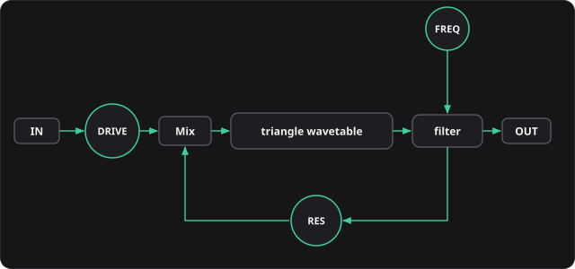

# Soundemote for VCV Rack

## Superlove Filter

Superlove Filter uses a hand crafted "Phase-feedback wavetable" algorithm that recreates the style of a boutique MS20 clone with Doepfer Xtreme amounts of distortion. Using the lowpass filter on a sawtooth makes for good basses. Filter with medium drive and resonance for growling lows and smooth highs. Lower the resonance and turn up the drive for warmth and saturation. The bandpass and highpass filters are a different beast going quickly into screaming self oscillation, but if dialed carefully these modes allow for musical leads with an organic quality. This filter will feel at home in 80s and 90s music. Superlove algorithm is different from most filters. At the heart of the LP18/LP24 algorithm sits a soft-edged triangle waveshaper. The soft edge prevents aliasing and is responsible for Superlove's growly texture.

| | |
| --- | --- |
| **FREQ** | Cutoff. 1V/oct on the FREQ jack. |
| **RES** | Feedback into triangle wavetable phase. Self-oscillates in all modes. Screams in HP / BP. |
| **DRIVE** | Input gain (0×–4×). Noon is 1×. Default 0.5×. |
| **NOISE** | Noise into the filter. |
| **SPREAD** | Stereo frequency offset. |
| **MODES** | LP18, LP24, BP, HP. |

IN 1 only is mono (same signal on both outs). IN 1 and IN 2 is stereo. SPREAD applies in stereo. CLIP: driven input (jack × Drive) over ±10 V is 0.25 (blue); output over ±10 V is 1.0 (red); both clamp at 1.0.

## Audio Demos

- [Bandpass filter, high drive, max resonance](https://youtu.be/36fkv5bXsv0)
- [Highpass filter, high drive, various resonance](https://youtu.be/0YeF2PfKqDg)
- [Lowpass (LP24) filter, varying drive and resonance](https://youtu.be/zjAue88ahk8)
